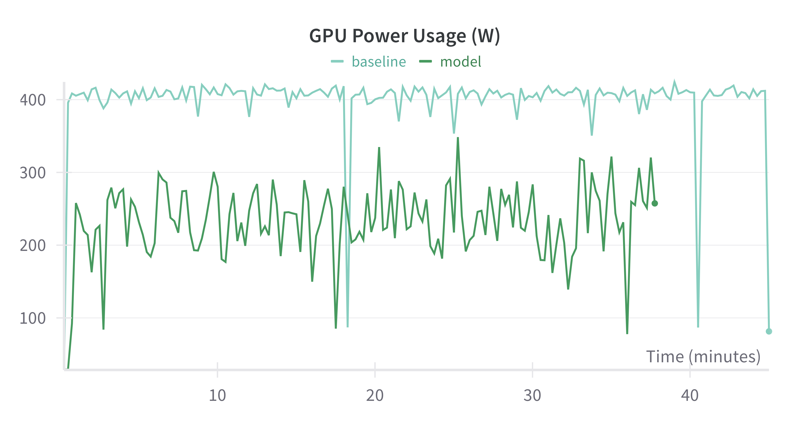
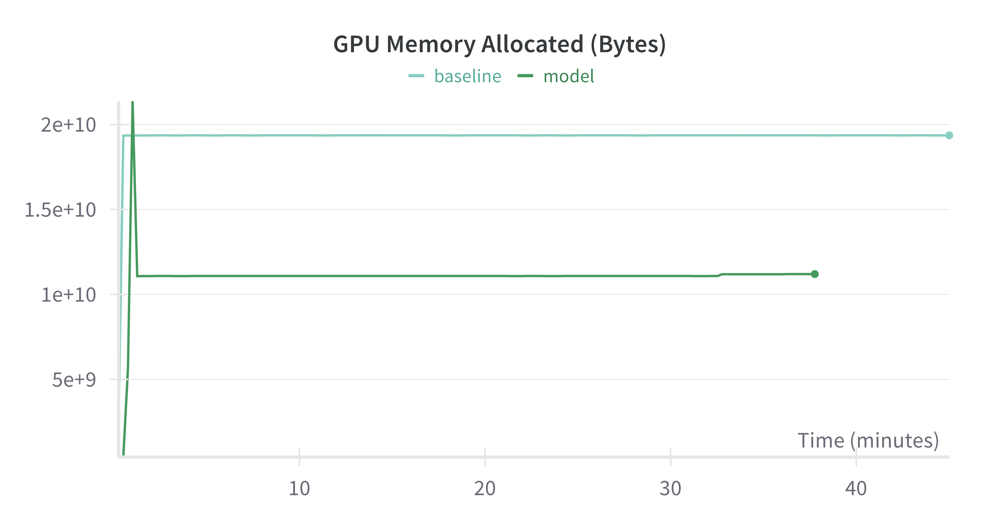
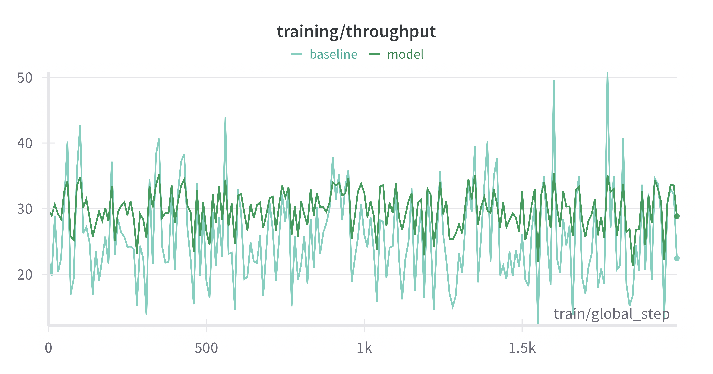

# Parallelization strategies for LoRA fine-tuning on LlaMA

## Description
A comprehensive study comparing various parallelization strategies—Data Parallelism, Model (Tensor) Parallelism, Pipeline Parallelism, and Hybrid Parallelism—using PyTorch and DeepSpeed on a 1B-parameter model. This project evaluates each approach based on training throughput, GPU memory usage, utilization, and overall training time.

## Features
- **Data Parallelism** using PyTorch DDP for gradient synchronization.
- **Model Parallelism** (tensor parallelism) via DeepSpeed for sharding model parameters.
- **Pipeline Parallelism** with micro-batch pipelining across GPUs.
- **Hybrid Parallelism** combining pipeline and data parallelism.

## Evaluation Metrics
- **Throughput**: Samples or tokens processed per second (including overhead).
- **Goodput**: Useful gradient updates per second.
- **Statistical Efficiency**: Speed to reach target performance (loss/accuracy).
- **Total Wall Time**: Real-world duration for training.
- **Loss**: Cross-entropy loss on next-token prediction.
- **GPU Memory Usage**: Memory footprint during training/inference.
- **GPU Utilization**: Compute capacity usage percentage.

<p align="center">
  
  
  
</p>


## Experimental Results Summary
| Strategy                     | Time Reduction | Throughput Increase | Memory Reduction | 
|------------------------------|---------------:|--------------------:|-----------------:|
| **Data Parallelism (DDP)**   | 1.2× faster    | 1.3× higher         | 1.7× lower       | 
| **Model Parallelism**        | 1.3× faster    | 1.1× higher         | 1.75× lower      | 
| **Pipeline Parallelism**     | 1.2× faster    | 1.7× higher         | 1.83× lower      | 
| **Hybrid Parallelism**       | 1.2× faster    | 1.2× higher         | 1.9× lower       | 

## Usage

```bash
# Data Parallelism
env OMP_NUM_THREADS=1 python train.py --strategy data_parallel --model_size 1B

# Pipeline Parallelism
env OMP_NUM_THREADS=1 python train.py --strategy pipeline_parallel --stages 2

# Hybrid Parallelism
env OMP_NUM_THREADS=1 python train.py --strategy hybrid_parallel --nodes 2 --gpus_per_node 1

Weights & Biases: https://wandb.ai/ml710_project/main/table?nw=nwuserdianaturmakhan
